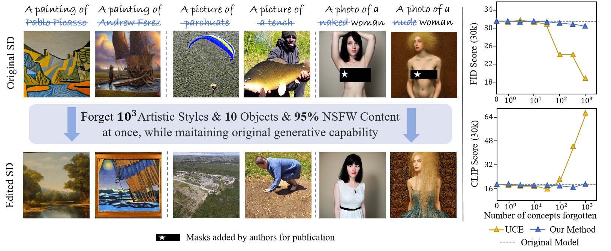
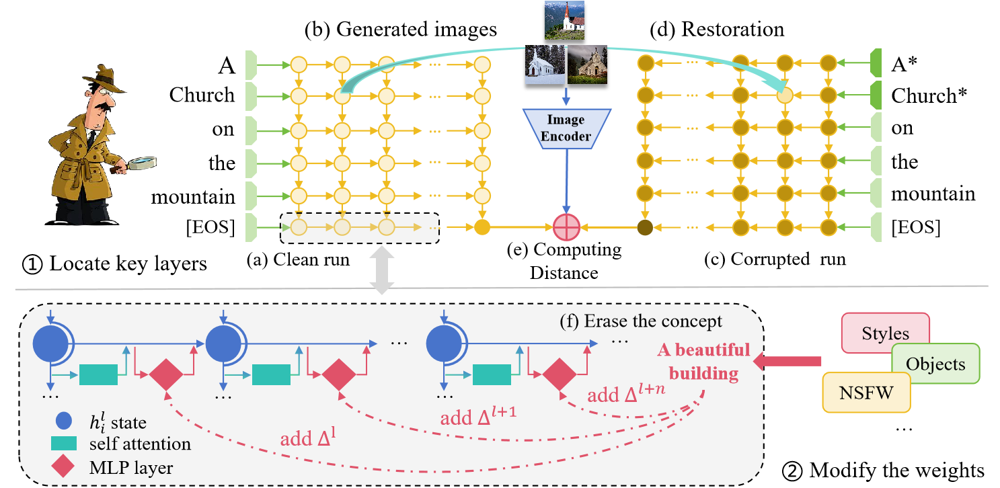

# Bulk Concepts Forgetting for Text-to-Image Diffusion Models



##  Abstract
With the growing concerns that have been discussed about privacy infringement, offensive, and inappropriate content in text-to-image diffusion models, recent years have witnessed the promise of selectively forgetting concepts to moderate the issues. However, current methods are limited to the scale of the forgetting concepts, leaving a big gap in real-world utilization. In this work, we propose **B**ulk **C**oncepts **F**orgetting (**BCF**), a method for forgetting a bulk of concepts at once. We begin by employing causal tracing to analyze the key layers within the text encoder of the diffusion model, which are responsible for storing concepts. We then modify the weights of these key layers using a mass of concepts. The results demonstrate that our method, BCF, can effectively forget ten times more concepts compared to previous approaches, while still maintaining the original capability of text-to-image generation. Additionally, we showcase the versatility of BCF in erasing artistic styles, objects, and NSFW content. Together, BCF enhances the scalability and effectiveness of previous methods for forgetting a large number of concepts.   



## Installation
```
conda create -n bcf python=3.10
conda activate bcf
cd bcf
pip install -r requirement.txt
```

## Run BCF

- Forgetting Artistic Styles

```
python clip_edit.py --file 'data/art_forget/artist_list_forget_10.csv' --algorithm 'bcf' --concept_type 'artist_forget' --seed 42 --v_similarity_metric "cosine"
```

- Forgetting Objects

```
python clip_edit.py --file 'data/object_forget/object_erase_10.csv' --algorithm 'bcf' --concept_type 'object_forget' --seed 42 --v_similarity_metric "cosine"
```

- Forgetting NSFW

```
python clip_edit.py --file 'data/nsfw_forget/nsfw_list_forget_all.csv' --algorithm 'bcf' --concept_type 'NSFW' --seed 42 --v_similarity_metric "cosine"
```

Forgetting results are stored at `images/results/bcf/<concept_type>/` .

Edited model are stored at `model/<concept_type>/` .


